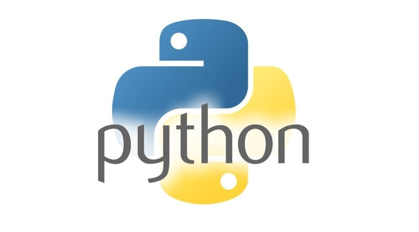
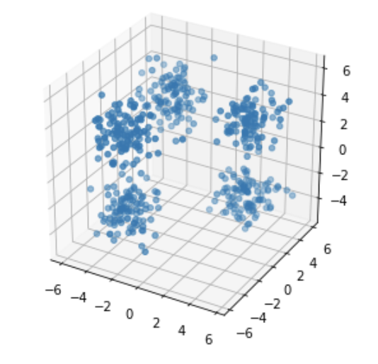
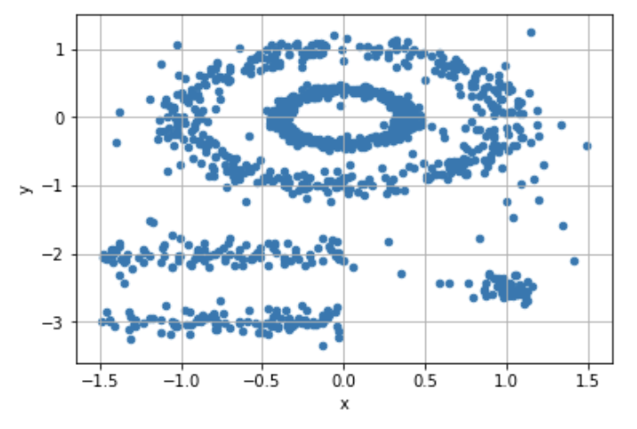

univlille--mastersiad--bigdata-tp
==================================

> [Université de Lille] Master SIAD - BigData

TP BIGDATA - 2019
---------

**TP1 (18/10): introduction au langage python**

- OBJECTIFS :

    - PARTIE I : découverte du langage python, de son environnement de développement et des packages les plus utilisés en data science ;
    - PARTIE II : mise en pratique des modules découverts via l'analyse descriptive

- DONNEES : titanic passengers (à télécharger et placer dans un dossier "titanic" à la racine du projet)

**TP2 (25/10): apprentissage supervisé (classification binaire)**

- OBJECTIFS : premiers modèles de classification binaire à l’aide de la bibliothèque scikit-learn

    - PARTIE I : prétraitement des données (missing values, feature engineering et feature selection) ;
    - PARTIE II : modélisation et performance d'un modèle de classification binaire et
    - PARTIE III : comparaison de deux modèles.

- DONNEES : titanic passengers

**TP3 (08/11 + 15/11): apprentissage supervisé (classification multi classes)**

- OBJECTIFS : classification multiclasse à l’aide de la bibliothèque scikit-learn et keras.

    - PARTIE I : prise en main de la base de données (images de chiffres manuscrits) et modélisation avec scikit-learn (k-plus-proche-voisin) ;
    - PARTIE II : modélisation avec keras (perceptron multicouche et réseaux de neurones convolutifs)

- DONNEES : MNIST

**TP4 (22/11): apprentissage non supervisé**

- OBJECTIFS : découverte des fonctionnalités de la plateforme scikit-learn concernant les algorithmes d’apprentissage non supervisé.

    - PARTIE I: compréhension des fonctionnalités de scikit-learn concernant l’algorithme k-means et meilleure compréhension de l’impact de la technique d’initialisation.
    - PARTIE II: classification non supervisée par dénsité (DBSCAN et OPTICS).

- DONNEES : multipshapes (librairie R 'factoextra')
